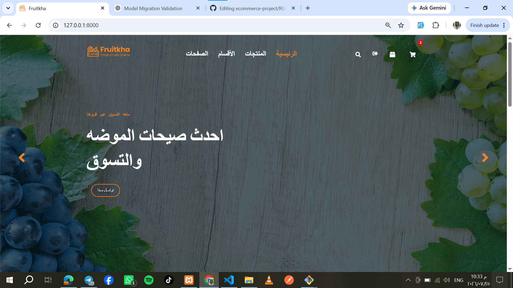
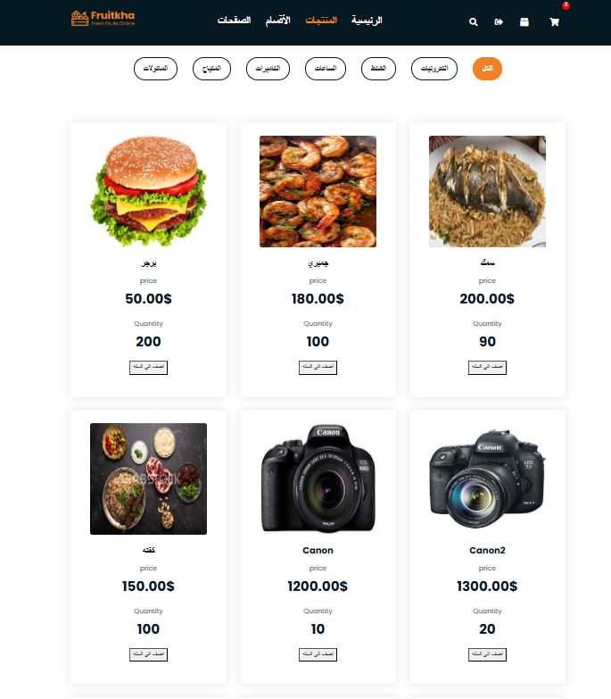
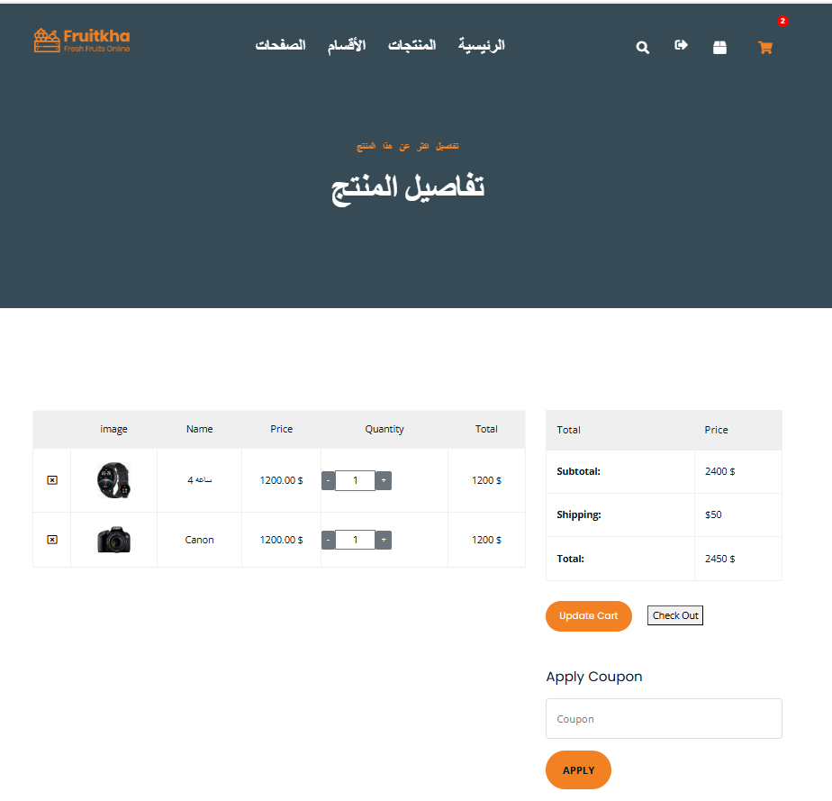
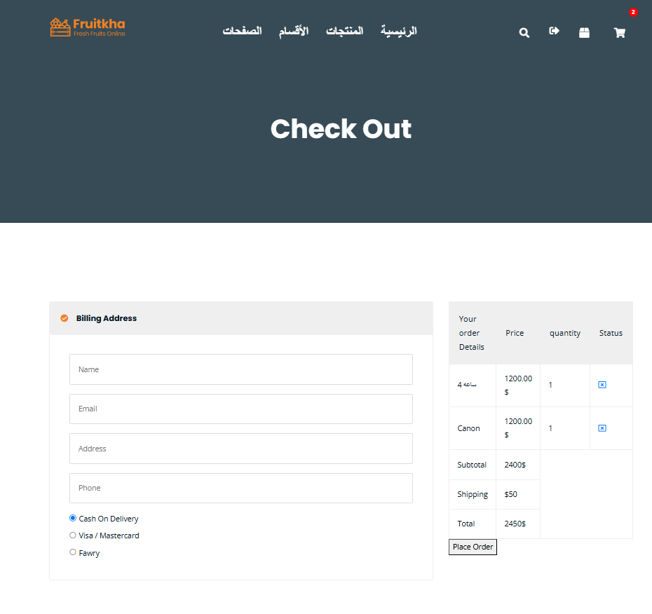
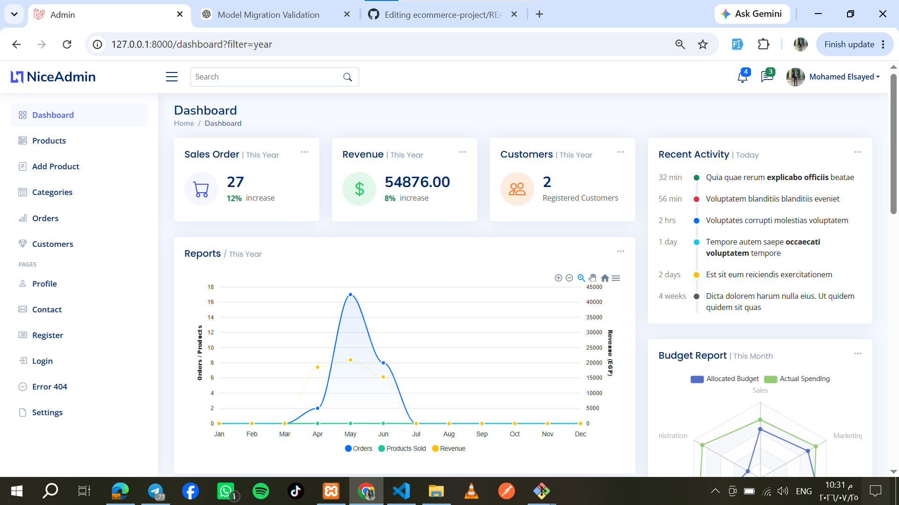

# 🛒 E-Commerce Management System

A full-featured E-Commerce web application built with **Laravel** that provides a seamless shopping experience for customers and a powerful admin dashboard for managing products, categories, orders, and sales analytics.

---

## 🚀 Features

### 👤 Customer

- Secure Authentication & Authorization
- Browse Products
- Product Search
- Product Details
- Shopping Cart
- Checkout Process
- Order History
- Responsive UI

### 🛠️ Admin

- Dashboard Analytics
- Revenue Statistics
- Orders Management
- Products Management
- Categories Management
- Top Selling Products
- Customer Statistics
- Sales Reports & Charts

---

## 🛠️ Tech Stack

| Technology | Used |
|------------|------|
| Laravel | ✅ |
| PHP | ✅ |
| MySQL | ✅ |
| Bootstrap 5 | ✅ |
| HTML5 | ✅ |
| CSS3 | ✅ |
| JavaScript | ✅ |
| ApexCharts | ✅ |
| Git & GitHub | ✅ |

---

## 📊 Dashboard Features

- 📦 Total Orders
- 💰 Total Revenue
- 👥 Total Customers
- 🔥 Top Selling Products
- 📈 Sales Analytics Chart
- 📋 Latest Orders

---

## 📸 Screenshots

### 🏠 Home Page



---

### 🛍️ Products



---

### 🛒 Shopping Cart



---

### 💳 Checkout



---

### 📊 Admin Dashboard



---

### 📈 Analytics


---

## ⚙️ Installation

```bash
git clone https://github.com/Mo7amedElsay3d/ecommerce-project.git

cd ecommerce-project

composer install

cp .env.example .env

php artisan key:generate

php artisan migrate

php artisan serve
```

---

## 📁 Project Structure

```
app/
resources/
routes/
public/
database/
```

---

## 🔮 Future Improvements

- Online Payment Integration (Paymob)
- Wishlist
- Coupons & Discounts
- Product Reviews
- Email Notifications
- Inventory Alerts
- REST API
- AJAX Dashboard Updates

---

## 👨‍💻 Author

**Mohamed Elsayed**

Backend Developer | PHP Laravel

- GitHub: https://github.com/Mo7amedElsay3d
- LinkedIn: https://www.linkedin.com/in/mohamed-elsayed-432624297/